# Titanic Survival Prediction — Advanced Machine Learning Capstone

An end-to-end machine learning capstone built around the Titanic survival prediction problem.

This project combines the major machine learning concepts I worked through into one complete workflow. Instead of stopping at model training and accuracy, the project covers the full process from understanding the data to validating, tuning, evaluating, interpreting, and analyzing a final model.

The focus of the project is not simply getting the highest possible score. It is building a **proper machine learning workflow** where preprocessing, validation, model selection, tuning, evaluation, and analysis are handled in a structured way.

---

## Project Structure

```text
titanic-survival-prediction/
│
├── titanic-survival-prediction.py
│
├── images/
│   ├── Classification-Threshold-Analysis.png
│   ├── Cross-Validated-Model-Comparison.png
│   ├── Final-Model-Confusion-Matrix.png
│   ├── Missing-Values.png
│   ├── Numerical-Feature-Correlations.png
│   ├── Numerical-Feature-Distributions.png
│   ├── Numerical-Feature-Outliers.png
│   ├── Permutation-data-Importance.png
│   ├── ROC-and-PR-Curve.png
│   ├── Survival-by-Embarkation-Port.png
│   ├── Survival-by-Passenger-Class.png
│   ├── Survival-by-Sex.png
│   └── Titanic-Survival-Distribution.png
│
└── output/
    └── titanic_final_predictions.csv
```

The trained model is also saved locally by the script as:

```text
titanic_final_model.pkl
```

This file is generated when the project is executed and is not included in the repository structure above.

---

## Dataset

The project uses the **Titanic dataset provided through OpenML** and loads it directly using scikit-learn:

```python
fetch_openml(
    name="titanic",
    version=1,
    as_frame=True
)
```

The dataset contains passenger information such as:

* Passenger class
* Sex
* Age
* Number of siblings/spouses aboard
* Number of parents/children aboard
* Fare
* Embarkation port
* Passenger name
* Cabin
* Ticket
* Boat
* Body
* Destination

The target variable is:

```text
survived
```

where:

* `0` = Did not survive
* `1` = Survived

Dataset source: [OpenML Titanic Dataset](https://www.openml.org/search?type=data&sort=runs&id=40945)

---

# Machine Learning Workflow

The project follows a structured end-to-end workflow:

```text
Load Dataset
      ↓
Understand Data
      ↓
Data Cleaning
      ↓
Leakage Prevention
      ↓
Exploratory Data Analysis
      ↓
Feature Engineering
      ↓
Train/Test Split
      ↓
Preprocessing Pipeline
      ↓
Candidate Model Comparison
      ↓
Cross-Validation
      ↓
Top Model Selection
      ↓
Hyperparameter Tuning
      ↓
Final Model Selection
      ↓
Test Set Evaluation
      ↓
Threshold Analysis
      ↓
Permutation Feature Importance
      ↓
Error Analysis
      ↓
Prediction Output
      ↓
Model Serialization
```

This structure was intentional. The test set is kept separate until the final evaluation, while preprocessing and model fitting are handled inside pipelines.

---

# 1. Data Loading and Understanding

The project begins by loading the Titanic dataset and examining its structure before making modeling decisions.

The following are inspected:

* Dataset shape
* First rows
* Data types
* Dataset information
* Statistical summaries
* Missing values
* Duplicate rows

This gives an initial understanding of the data rather than immediately fitting a model.

---

# 2. Data Cleaning and Leakage Prevention

One of the important parts of this project was deciding which features should and should not be used.

The following columns were removed:

```python
drop_columns = [
    "boat",
    "body",
    "cabin",
    "ticket",
    "home.dest"
]
```

### Leakage-prone features

`boat` and `body` are particularly problematic because they contain information that is closely associated with the outcome and would not represent information realistically available when making the original prediction.

Removing these features prevents the model from learning from information that effectively reveals the outcome.

### High-cardinality / unsuitable features

`ticket` and `home.dest` were removed because their raw categorical representations add unnecessary complexity and high cardinality.

`cabin` contains a large amount of missing information and was excluded rather than forcing an artificial representation of a feature with limited reliability.

Duplicate records were also removed before modeling.

---

# 3. Exploratory Data Analysis

Before training the models, the dataset was explored visually.

## Target Distribution

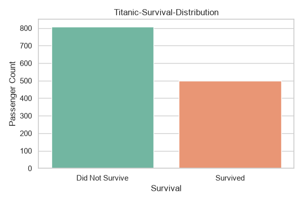

The target distribution is examined to understand the balance between surviving and not surviving passengers.

---

## Numerical Feature Distributions

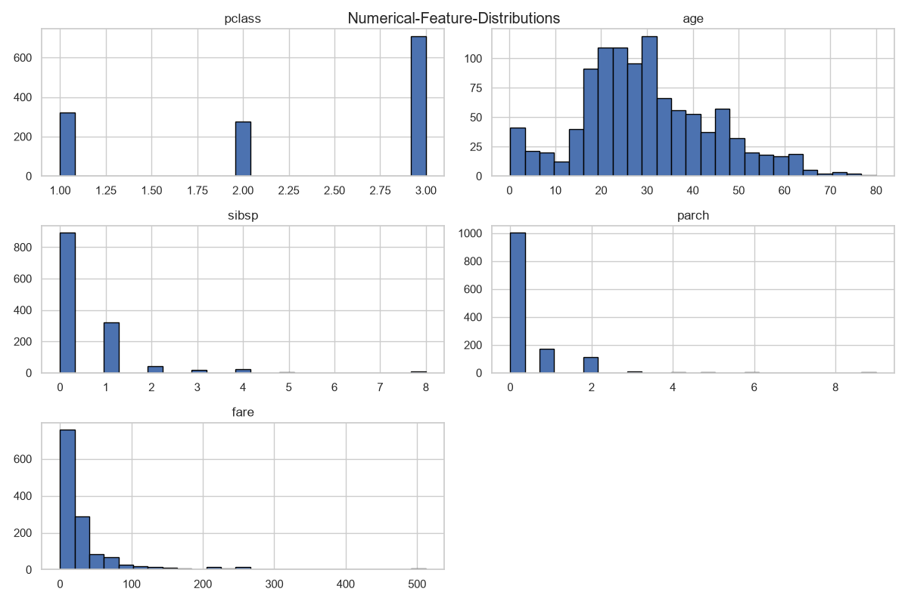

The numerical variables are visualized to understand their distributions and identify unusual patterns.

---

## Missing Values

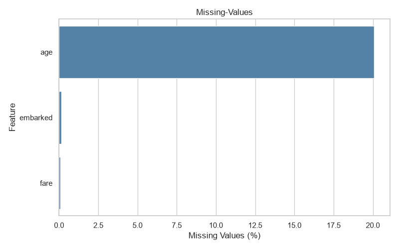

Missing-value percentages are visualized before preprocessing decisions are made.

Rather than manually filling missing values before the train/test split, missing-value handling is later placed inside the preprocessing pipeline.

---

## Numerical Feature Outliers

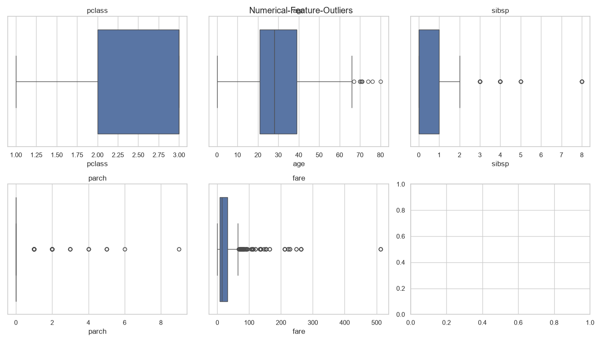

Boxplots are used to inspect numerical features for potential outliers.

The project does not blindly remove these observations. Instead, the preprocessing and tree-based models are allowed to handle the data without unnecessary deletion of potentially meaningful passengers.

---

## Survival by Sex

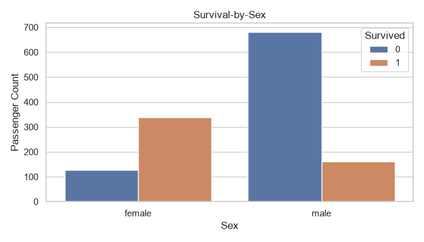

This visualization examines the relationship between passenger sex and survival.

---

## Survival by Passenger Class

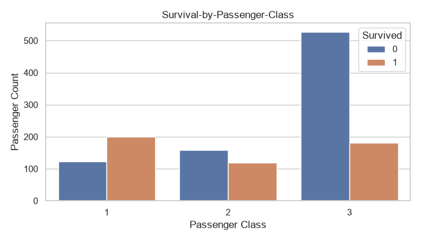

Passenger class is examined against survival outcomes to identify an important categorical relationship.

---

## Survival by Embarkation Port

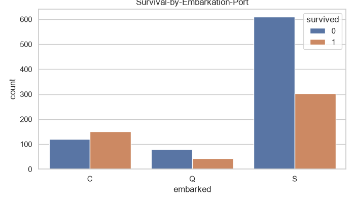

Survival patterns are also examined across embarkation locations.

---

## Numerical Feature Correlations

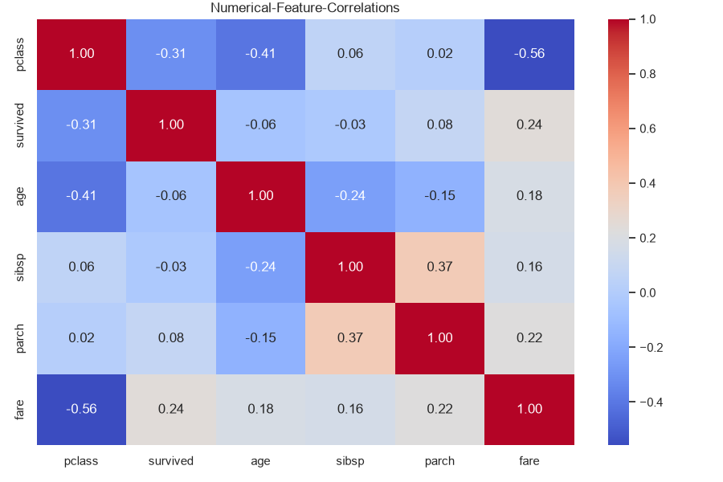

A correlation heatmap is used to inspect relationships between numerical variables.

EDA is used here primarily to **understand the data and guide modeling decisions**, rather than to manually optimize the model around the test set.

---

# 4. Feature Engineering

Several features were engineered from the existing passenger information.

## Passenger Title

Passenger names were used to extract titles such as:

* Mr
* Miss
* Mrs
* Master

Less common titles were grouped into:

```text
Rare
```

This transforms a high-cardinality name field into a compact categorical feature that can capture useful demographic information.

The original `name` column is then removed.

---

## Family Size

Family size is calculated as:

```python
family_size = sibsp + parch + 1
```

This combines the number of siblings/spouses and parents/children aboard into a more interpretable feature.

---

## Traveling Alone

A binary feature identifies whether a passenger was traveling alone:

```python
is_alone = (family_size == 1).astype(int)
```

---

## Fare Per Person

Fare is normalized using family size:

```python
fare_per_person = fare / family_size
```

This attempts to provide a more useful representation of the fare paid relative to the passenger's family group.

---

# 5. Train/Test Split

The dataset is split into training and testing data using:

```python
train_test_split(
    X,
    y,
    test_size=0.20,
    random_state=42,
    stratify=y
)
```

The important part here is that the split happens **before fitting preprocessing components**.

`stratify=y` is used to preserve the target distribution across the training and test sets.

The test set is then kept aside for the final evaluation.

---

# 6. Preprocessing Pipeline

The preprocessing stage uses a `ColumnTransformer` with separate pipelines for numerical and categorical features.

### Numerical features

```text
Median imputation
        ↓
StandardScaler
```

### Categorical features

```text
Most-frequent imputation
        ↓
One-hot encoding
```

The categorical encoder uses:

```python
handle_unknown="ignore"
```

This prevents previously unseen categories from breaking the transformation process.

Most importantly, preprocessing is placed **inside the model pipeline** rather than being performed manually on the complete dataset.

This keeps preprocessing tied to the training process and helps prevent data leakage during cross-validation.

---

# 7. Candidate Models

Five different classification algorithms are compared:

### Logistic Regression

Used as an interpretable linear baseline.

### Random Forest

Used to capture nonlinear relationships and feature interactions.

### HistGradientBoosting

A scikit-learn gradient boosting approach.

### XGBoost

A powerful gradient boosting implementation designed for strong predictive performance.

### CatBoost

Another gradient boosting implementation providing a different boosting strategy for comparison.

All candidate models receive the same preprocessing framework, allowing the comparison to focus on the models rather than inconsistent preprocessing.

---

# 8. Cross-Validation and Model Comparison

The models are evaluated using:

```python
StratifiedKFold(
    n_splits=5,
    shuffle=True,
    random_state=42
)
```

Five-fold stratified cross-validation is used so that each model is evaluated across multiple training/validation splits.

The following metrics are collected:

* Accuracy
* Precision
* Recall
* F1
* ROC-AUC

ROC-AUC is used as the primary comparison metric.

This is more informative than selecting a model from a single train/test result because the models are compared across multiple validation folds.

---

## Cross-Validated Model Comparison

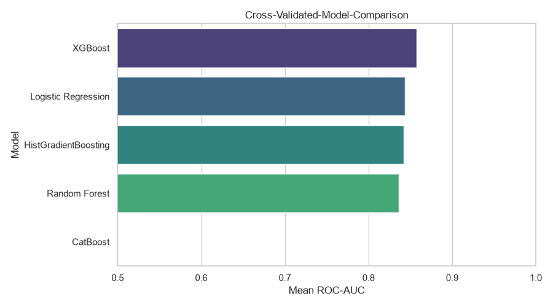

The cross-validation leaderboard is used to identify the strongest candidates for further tuning.

The top three models are carried forward into the hyperparameter tuning stage.

---

# 9. Hyperparameter Tuning

Instead of tuning every model indiscriminately, the project first compares the candidate algorithms and then focuses tuning effort on the strongest three:

* Random Forest
* XGBoost
* CatBoost

`RandomizedSearchCV` is used with five-fold stratified cross-validation.

Each model receives a dedicated parameter search space.

### Random Forest

Parameters explored include:

* Number of estimators
* Maximum depth
* Minimum samples for splitting
* Minimum samples per leaf
* Maximum features

### XGBoost

Parameters explored include:

* Number of estimators
* Learning rate
* Maximum depth
* Subsampling
* Column subsampling

### CatBoost

Parameters explored include:

* Number of iterations
* Tree depth
* Learning rate
* L2 regularization

Each search uses:

```python
n_iter=25
```

and is scored using ROC-AUC.

The best estimator from each search is retained.

---

# 10. Final Model Selection

The tuned Random Forest, XGBoost, and CatBoost models are compared using their best cross-validation ROC-AUC scores.

The final model is selected automatically:

```python
best_model_name = tuned_results.iloc[0]["Model"]
```

This means the final choice is based on validation performance rather than manually selecting a preferred algorithm.

---

# 11. Final Test Evaluation

Only after model selection and tuning is complete is the untouched test set used.

The final model is evaluated using:

* Accuracy
* Precision
* Recall
* F1
* ROC-AUC

A full classification report is also generated.

This separation between model development and final testing is an important part of the workflow.

---

# 12. Confusion Matrix

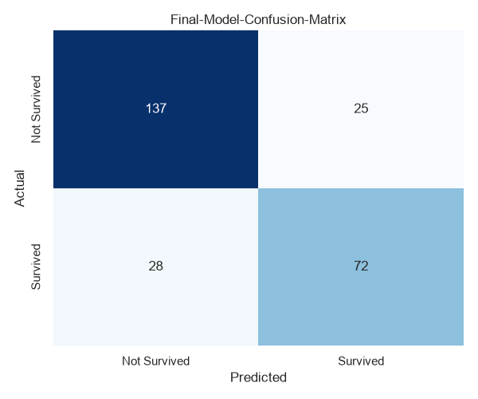

The confusion matrix provides a direct view of:

* True negatives
* False positives
* False negatives
* True positives

This complements the aggregate classification metrics and makes the types of prediction errors easier to inspect.

---

# 13. ROC and Precision-Recall Curves

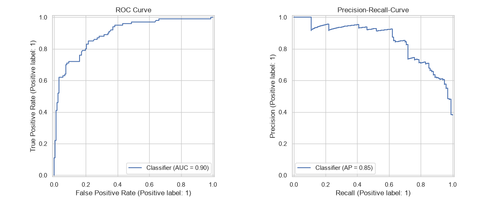

Both ROC and Precision-Recall curves are generated from the final model's predicted probabilities.

Using predicted probabilities instead of only hard predictions allows the model's behavior across different classification thresholds to be examined.

---

# 14. Classification Threshold Analysis

The default classification threshold is not treated as an unquestionable final decision.

Instead, thresholds from `0.20` to `0.80` are evaluated.

For every threshold, the project calculates:

* Precision
* Recall
* F1

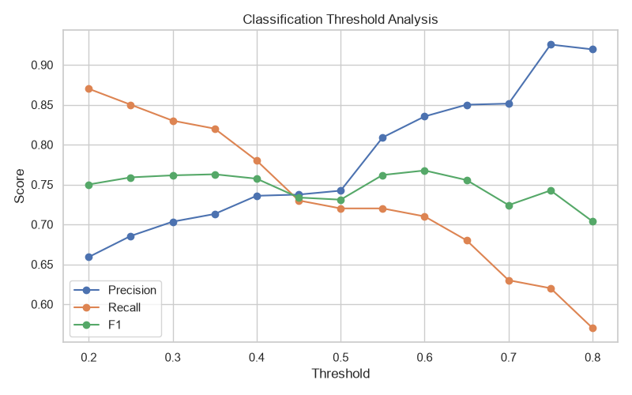

This demonstrates the trade-off between precision and recall and shows how changing the decision threshold changes the behavior of the classifier.

Importantly, threshold analysis does **not** retrain the model. It changes only the conversion of predicted probabilities into class predictions.

---

# 15. Permutation Feature Importance

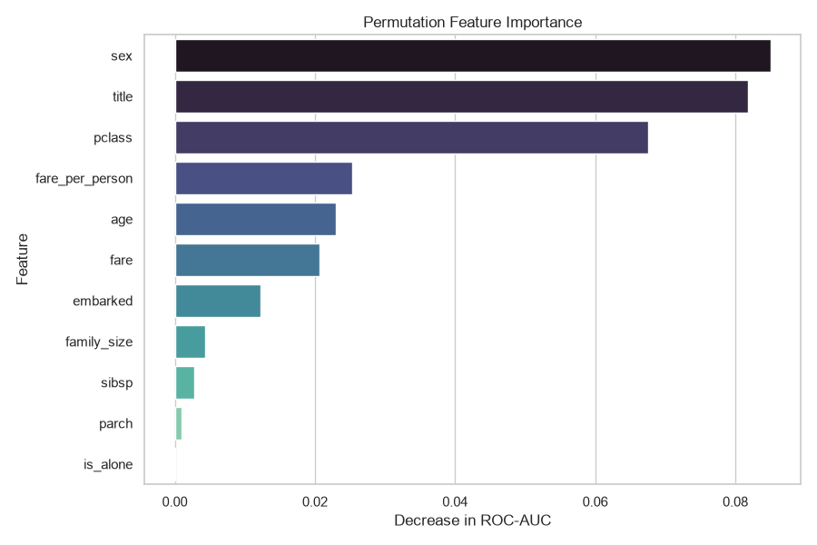

Permutation importance is used to estimate how much each original input feature contributes to predictive performance.

The important advantage here is that the importance is calculated through the **complete fitted pipeline** rather than manually inspecting only the transformed one-hot encoded features.

The project uses:

```python
scoring="roc_auc"
n_repeats=15
```

The resulting feature importance table contains both the mean importance and its standard deviation.

---

# 16. Error Analysis

The project does not stop after calculating the final metrics.

An explicit error-analysis dataset is constructed containing:

* Original test features
* Actual outcome
* Predicted outcome
* Survival probability
* Prediction confidence

Incorrectly classified passengers are isolated and sorted by confidence.

The project then examines errors by:

* Passenger sex
* Passenger class

This makes it possible to investigate **where the model is making mistakes**, rather than treating every incorrect prediction as identical.

This is one of the more important parts of the capstone because model evaluation should include understanding failure cases, not just reporting a score.

---

# 17. Prediction Output

The final test predictions are exported to:

```text
output/titanic_final_predictions.csv
```

The file contains:

| Column                 | Description                       |
| ---------------------- | --------------------------------- |
| `Actual`               | Actual survival outcome           |
| `Predicted`            | Model prediction                  |
| `Survival_Probability` | Predicted probability of survival |

This provides a clean prediction artifact that can be inspected independently of the training script.

---

# 18. Model Serialization

The complete final pipeline is saved using `joblib`:

```python
joblib.dump(
    final_model,
    "titanic_final_model.pkl"
)
```

Because the preprocessing and model are stored together inside the pipeline, the serialized object contains the complete transformation and prediction workflow.

This makes the trained model reusable without having to manually reconstruct the preprocessing steps.

This is **model serialization, not deployment**. The model is saved for later reuse, but it is not currently hosted as an API or application.

---

# What This Project Demonstrates

This capstone brings together the following machine learning concepts:

* Data loading and inspection
* Data cleaning
* Duplicate handling
* Missing-value analysis
* Data leakage prevention
* Exploratory data analysis
* Feature engineering
* Train/test splitting
* Stratified sampling
* Numerical preprocessing
* Categorical preprocessing
* `Pipeline`
* `ColumnTransformer`
* `SimpleImputer`
* `StandardScaler`
* `OneHotEncoder`
* Logistic Regression
* Random Forest
* HistGradientBoosting
* XGBoost
* CatBoost
* Stratified K-Fold Cross-Validation
* Multi-metric model evaluation
* Model comparison
* Randomized hyperparameter search
* ROC-AUC optimization
* Final test-set evaluation
* Confusion matrices
* ROC curves
* Precision-Recall curves
* Classification threshold analysis
* Permutation feature importance
* Error analysis
* Prediction export
* Model serialization with Joblib

---

# Why This Is More Than a Basic Titanic Project

Titanic is often used as a beginner machine learning dataset. This project intentionally goes much further than simply training a classifier and reporting accuracy.

The main emphasis is on the **process surrounding the model**.

The project:

1. Removes features that can introduce leakage.
2. Engineers domain-relevant features instead of relying entirely on raw columns.
3. Splits the data before fitting preprocessing components.
4. Keeps preprocessing inside a reusable pipeline.
5. Uses stratified cross-validation instead of relying on one validation split.
6. Compares several fundamentally different classification algorithms.
7. Tunes only the strongest candidate models.
8. Selects the final model based on cross-validated performance.
9. Evaluates the final model on an untouched test set.
10. Examines how classification thresholds affect precision, recall, and F1.
11. Uses permutation importance to interpret the final model.
12. Investigates incorrect predictions and their confidence.
13. Produces a clean prediction output.
14. Saves the complete trained pipeline for future reuse.

The goal was to demonstrate that a machine learning project is not just about choosing an algorithm. **Data preparation, validation strategy, model selection, evaluation, interpretation, and error analysis are all part of building the model properly.**

---

# Repository Contents

### Python Script

[`titanic-survival-prediction.py`](titanic-survival-prediction.py)

The complete capstone workflow, from dataset loading through final model serialization.

### Images

The `images/` directory contains the visual outputs generated throughout the analysis:

* `Titanic-Survival-Distribution.png`
* `Numerical-Feature-Distributions.png`
* `Missing-Values.png`
* `Numerical-Feature-Outliers.png`
* `Survival-by-Sex.png`
* `Survival-by-Passenger-Class.png`
* `Survival-by-Embarkation-Port.png`
* `Numerical-Feature-Correlations.png`
* `Cross-Validated-Model-Comparison.png`
* `Final-Model-Confusion-Matrix.png`
* `ROC-and-PR-Curve.png`
* `Classification-Threshold-Analysis.png`
* `Permutation-data-Importance.png`

### Output

[`output/titanic_final_predictions.csv`](output/titanic_final_predictions.csv)

Final predictions and survival probabilities for the test set.

---

# Technologies Used

* Python
* NumPy
* Pandas
* Matplotlib
* Seaborn
* Scikit-learn
* XGBoost
* CatBoost
* Joblib

---

# Running the Project

Install the required libraries:

```bash
pip install numpy pandas matplotlib seaborn scikit-learn xgboost catboost joblib
```

Then run:

```bash
python titanic-survival-prediction.py
```

The script downloads the Titanic dataset from OpenML, performs the complete workflow, generates the visualizations, writes the prediction output, and saves the final trained pipeline.

---

# Final Note

This project serves as my **advanced machine learning capstone**, bringing together the concepts and workflow developed throughout my machine learning projects into one complete classification problem.

Rather than treating the final metric as the entire result, the project focuses on building a workflow that can be inspected at every stage — from the original data and feature engineering decisions to validation, tuning, final predictions, feature importance, and model errors.


## Author

**Annchit Pathak**

This project was developed as my advanced machine learning capstone, bringing together the concepts and workflows covered throughout my machine learning journey.
